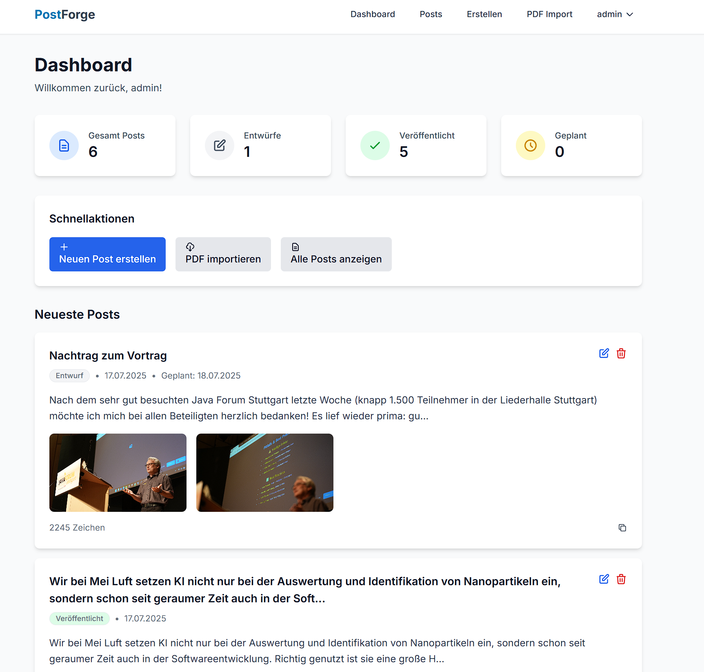

# PostForge - LinkedIn Post Manager

A comprehensive LinkedIn post management application designed as a local web application for creating, importing, and managing LinkedIn posts with PDF import functionality and image management.



## Features

### 📝 Post Management
- **Create & Edit Posts** - Full CRUD operations with rich text editing
- **Status Tracking** - Draft, Posted, Imported, Scheduled status management
- **Post Preview** - Real-time preview while editing
- **Search & Filter** - Find posts by content, hashtags, or status
- **Pagination** - Efficient browsing of large post collections
- **Post Duplication** - Copy existing posts for variations

### 📄 PDF Import
- **LinkedIn PDF Import** - Import posts from LinkedIn data export PDFs
- **Intelligent Parsing** - Advanced pattern recognition for German LinkedIn exports
- **Content Cleaning** - Automatically removes LinkedIn UI elements and artifacts
- **Metadata Extraction** - Extracts author, company, engagement stats, and timestamps
- **Preview Before Import** - Review and select which posts to import

### 🖼️ Image Management
- **Multi-Image Upload** - Drag & drop or browse to upload multiple images
- **Image Gallery** - Visual management of post images
- **Thumbnail Generation** - Automatic thumbnail creation
- **File Validation** - Support for PNG, JPG, GIF, WEBP up to 10MB
- **Download for LinkedIn** - Easy download of images for LinkedIn posting

### 📋 LinkedIn Integration
- **Smart Copy Function** - Copy text to clipboard
- **Image Download Modal** - Download all post images with original filenames
- **Complete Workflow** - Text + images ready for LinkedIn posting

### 🔐 User Management
- **Secure Authentication** - User registration and login system
- **Personal Posts** - Each user manages their own posts
- **Session Management** - Secure session handling with Flask-Login

### 📤 Export & Import
- **Data Export** - Export all posts and images as ZIP file
- **Data Import** - Import posts and images from ZIP files
- **Cross-Platform** - Move posts between different PostForge instances
- **Backup & Restore** - Complete backup of your post data
- **Automatic Conflict Resolution** - Imported posts get unique filenames

### 🔗 Post Review & Sharing
- **Review Links** - Generate shareable links for post review
- **Public Preview** - Share posts without requiring login
- **Toggle Control** - Easily enable/disable sharing
- **Secure Access** - Unique tokens for each shared post
- **LinkedIn Preview** - Shows how posts will appear on LinkedIn

### 👨‍💼 Admin Features
- **User Management** - Admin can manage all users
- **Registration Tokens** - Control user registration with invite tokens
- **Token Generation** - Create and manage registration tokens
- **User Overview** - View all registered users and their activity
- **Access Control** - Restrict registration to invited users only

## Tech Stack

### Backend
- **Python 3.11+** - Modern Python with type hints
- **Flask 3.0** - Lightweight web framework
- **SQLAlchemy 2.0** - Modern ORM with async support
- **Flask-Login** - User session management
- **Flask-WTF** - Form handling and CSRF protection
- **Flask-Migrate** - Database migrations

### Frontend
- **Jinja2** - Server-side templating
- **TailwindCSS 3.x** - Utility-first CSS framework
- **Alpine.js 3.x** - Lightweight JavaScript framework
- **HTMX 1.9** - Modern web interactions

### Database
- **SQLite** - Development database
- **PostgreSQL Ready** - Production migration capability

### File Processing
- **pdfplumber** - Advanced PDF text extraction
- **PyPDF2** - Fallback PDF processing
- **Pillow** - Image processing and validation

## Installation

### Prerequisites
- Python 3.11 or higher
- Node.js (for TailwindCSS building)

### Setup

1. **Clone the repository**
```bash
git clone <repository-url>
cd PostForge
```

2. **Create virtual environment**
```bash
python -m venv .venv
source .venv/bin/activate  # Linux/Mac
# or
.venv\Scripts\activate     # Windows
```

3. **Install Python dependencies**
```bash
pip install -r requirements.txt
```

4. **Install Node.js dependencies**
```bash
npm install
```

5. **Build TailwindCSS**
```bash
npm run build-css
```

6. **Initialize database**
```bash
python init_db.py
```

7. **Run the application**
```bash
python app.py
```

**Note:** Use `python app.py` instead of `flask run` for better compatibility with the database migration system.

The application will be available at:
- `http://localhost:5000` (local only)
- `http://0.0.0.0:5000` (accessible from network)

**Login credentials:**
- **Username**: `admin`
- **Password**: Check console output for auto-generated password

## Usage

### Getting Started
1. **Register** a new account or login (admin user is created automatically)
2. **Create your first post** using the "Neuen Post erstellen" button
3. **Upload images** by dragging and dropping files
4. **Import LinkedIn posts** from PDF exports

### Admin Setup
- **Default Admin User**: `admin`
- **Password**: Auto-generated during first startup (displayed in console)
- **Password Reset**: Use `python reset_admin_password.py` to reset admin password
- **First Login**: Use admin credentials to access user management
- **Registration Tokens**: Generate tokens for controlled user registration

### LinkedIn PDF Import
1. Navigate to **Upload → PDF Import**
2. Upload your LinkedIn data export PDF
3. **Preview** the extracted posts
4. **Select** which posts to import
5. Posts are imported with "imported" status

### Copying for LinkedIn
1. Click **"Für LinkedIn kopieren"** on any post
2. Text is automatically copied to clipboard
3. If the post has images, a **download modal** appears
4. Download images and upload them to LinkedIn
5. Paste the text content

### Export & Import
1. **Export Posts**: Navigate to **Export/Import** section
2. Click **"Posts exportieren"** to download all posts and images as ZIP
3. **Import Posts**: Upload a ZIP file from another PostForge instance
4. **Review Import**: Imported posts are marked with "imported" status
5. **Conflict Resolution**: Images get unique filenames to prevent conflicts

### Post Review & Sharing
1. **Enable Sharing**: In post edit view, toggle "Für Review freigeben"
2. **Copy Link**: Use the generated link to share with reviewers
3. **Public Access**: Reviewers can view post without login
4. **LinkedIn Preview**: Reviewers see how the post will look on LinkedIn
5. **Disable Sharing**: Turn off sharing when review is complete

### Admin Functions
1. **Access Admin**: Login as admin user to access admin panel
2. **User Management**: View all users, their post counts, and activity
3. **Registration Tokens**: Generate tokens for controlled user registration
4. **Token Management**: Create, view, and delete registration tokens
5. **User Registration**: Share tokens with users for secure registration

## Development

### Project Structure
```
PostForge/
├── app/
│   ├── models/          # Database models
│   ├── routes/          # Flask routes
│   ├── templates/       # Jinja2 templates
│   ├── static/          # CSS, JS, uploads
│   ├── utils/           # Utility modules
│   └── forms/           # WTForms
├── migrations/          # Database migrations
├── instance/            # Instance-specific files
├── requirements.txt     # Python dependencies
├── package.json         # Node.js dependencies
└── tailwind.config.js   # TailwindCSS configuration
```

### Development Commands

```bash
# Initialize database (first time setup)
python init_db.py

# Development server with auto-reload
python app.py

# Reset admin password
python reset_admin_password.py

# Database operations (for future migrations)
flask db migrate -m "Migration description"
flask db upgrade
flask db downgrade

# CSS development (watch mode)
npm run build-css

# CSS production build
npm run build-css-prod
```

### Configuration

The application supports different configurations:
- **Development**: Debug enabled, SQLite database
- **Production**: Optimized settings, PostgreSQL support

Environment variables:
- `SECRET_KEY` - Flask secret key
- `DATABASE_URL` - Database connection string
- `FLASK_CONFIG` - Configuration environment (default, development, production)
- `ADMIN_PASSWORD` - Set admin password (optional, auto-generated if not set)

## Security Features

- **CSRF Protection** - All forms protected against CSRF attacks
- **File Upload Validation** - Secure file type and size validation
- **Session Security** - Secure cookie settings
- **Input Sanitization** - Protection against XSS attacks
- **User Isolation** - Users can only access their own posts
- **Secure Tokens** - Cryptographically secure tokens for sharing and registration
- **Admin Access Control** - Admin functions restricted to admin users only

## Contributing

1. Fork the repository
2. Create a feature branch (`git checkout -b feature/amazing-feature`)
3. Commit your changes (`git commit -m 'Add amazing feature'`)
4. Push to the branch (`git push origin feature/amazing-feature`)
5. Open a Pull Request

## Testing

The application includes comprehensive testing:
- Unit tests for models and utilities
- Integration tests for file upload and processing
- Frontend component tests for Alpine.js interactions

```bash
# Run tests (when implemented)
python -m pytest
```

## Deployment

### Production Setup
1. Use **Gunicorn** + **Nginx** for production
2. Set environment variables for security
3. Use **PostgreSQL** for production database
4. Enable SSL/HTTPS
5. Configure proper backup strategies

### Docker Support

The easiest way to run PostForge is using Docker:

```bash
# Pull and run the latest image
docker run -d \
  --name postforge \
  -p 5000:5000 \
  -v postforge_data:/app/instance \
  -v postforge_uploads:/app/static/uploads \
  ghcr.io/dg1001/postforge:latest
```

Access the application at `http://localhost:5000`

**Docker Options:**
- `-d` - Run in detached mode
- `-p 5000:5000` - Map port 5000 to host
- `-v postforge_data:/app/instance` - Persist database
- `-v postforge_uploads:/app/static/uploads` - Persist uploaded files

**Environment Variables:**
```bash
docker run -d \
  --name postforge \
  -p 5000:5000 \
  -e SECRET_KEY="your-secret-key" \
  -e ADMIN_PASSWORD="your-admin-password" \
  -e FLASK_ENV="production" \
  -v postforge_data:/app/instance \
  -v postforge_uploads:/app/static/uploads \
  ghcr.io/dg1001/postforge:latest
```

**Admin User Setup:**
- **Username**: `admin` (fixed)
- **Password**: Set via `ADMIN_PASSWORD` environment variable
- **Auto-Generation**: If `ADMIN_PASSWORD` is not set, a random 12-character password is generated
- **Password Display**: The password is shown in the Docker logs on first startup

**Check generated password:**
```bash
docker logs postforge
```

**Docker Compose:**
```yaml
version: '3.8'
services:
  postforge:
    image: ghcr.io/dg1001/postforge:latest
    ports:
      - "5000:5000"
    environment:
      - SECRET_KEY=your-secret-key
      - ADMIN_PASSWORD=your-admin-password  # Optional: will be auto-generated if not set
      - FLASK_ENV=production
    volumes:
      - postforge_data:/app/instance
      - postforge_uploads:/app/static/uploads
    restart: unless-stopped

volumes:
  postforge_data:
  postforge_uploads:
```

**Available Tags:**
- `latest` - Latest stable version
- `vX.X.X` - Specific version tags

## License

This project is licensed under the Creative Commons Attribution-NonCommercial 4.0 International License - see the [LICENSE](LICENSE) file for details.

This means you are free to:
- Share: copy and redistribute the material in any medium or format
- Adapt: remix, transform, and build upon the material

Under the following terms:
- Attribution: You must give appropriate credit
- NonCommercial: You may not use the material for commercial purposes

## Acknowledgments

- Built with modern web technologies
- Inspired by the need for better LinkedIn content management
- Designed for content creators and social media managers
- **Created with the assistance of Claude Code using the Pro Plan subscription**

## Support

For support, please open an issue on the GitHub repository or contact the development team.

---

**PostForge** - Forge your LinkedIn presence with ease! 🔥